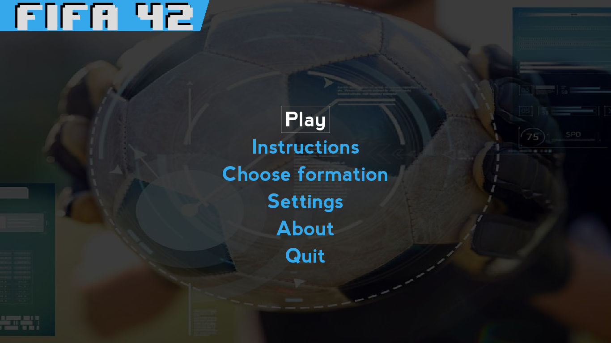
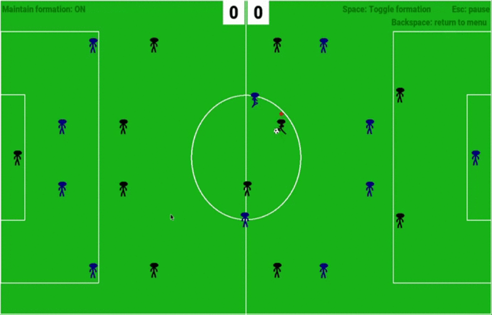
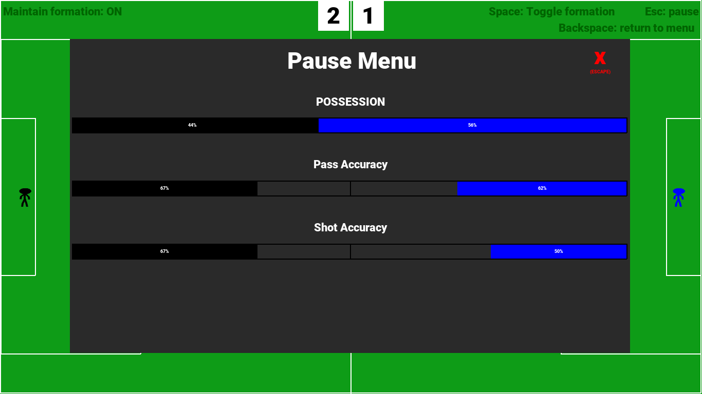

# Fifa-42     	  
An 11 v 11 football game where you play against the computer. Choose your own formations and get ready to play!

## Play

### [Windows](https://github.com/MananSoni42/Fifa-42/releases/download/v1.0.0/Fifa-42-win.exe) |  [Linux](https://github.com/MananSoni42/Fifa-42/releases/download/v1.0.0/Fifa-42-linux)
### Basics
* This is an 11v11 football game where you (Team 1) play against the computer (Team 2)
* You control a single player (marked by a red dot on top)
* Running into opponent players causes both of you to be thrown back and lose possession of the ball

### Controls
  Key                  | Action                    
  -------------------- | --------------------------
  Arrow keys           | Move the (selected) player
  Q,W,E - A,D - Z,X,C  | Shoot the ball
  ESC                  | Bring up / Collapse Pause menu
  SPACE                | Toggle if teams maintain formation
  BACKSPACE            | Quit and return to main menu

## Screens
### Main menu

### In-game

### Pause menu

## Contributing
Feel free to contribute features / point out errors. Fork this repository and make a pull request.  
Make sure you go through the [wiki](https://github.com/MananSoni42/Fifa-42/wiki) to get an idea of how the code is structured and the conventions that we have used.

## License
This project is licensed under the [MIT](https://opensource.org/licenses/MIT) License
